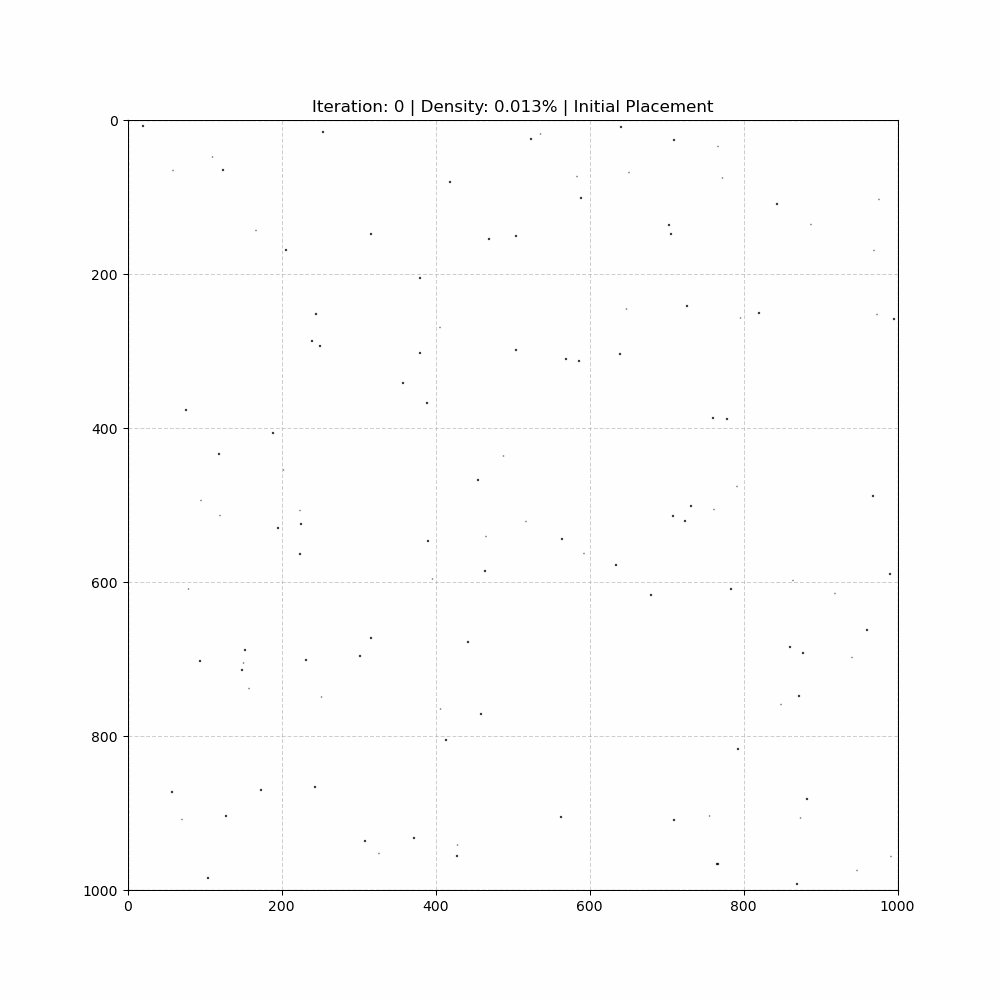

### 注意

edge 的指向是雙向的

# 專案說明文件 (note.md)

## 專案總覽

本專案是一個用於**生成複雜二維積體電路佈局樣本**的工具鏈。其核心目標是透過一個受物理特性約束的、具備隨機性的演算法，自動產生大量多樣化的佈局資料集。這些資料最終可以被格式化為適用於機器學習（特別是圖神經網路 GNN）模型訓練的格式。

整個流程包含四個主要階段：
1.  **參數化配置**：透過 `config.yaml` 靈活定義生成規則。
2.  **佈局生成**：執行 `main.py`，根據配置產生包含元件、引腳和連線的原始佈局資料。
3.  **分析與視覺化**：使用 `analyze_layout.py` 對單一樣本進行視覺化繪圖與數據統計分析。
4.  **機器學習格式化**：執行 `format_for_ml.py` 將整批原始資料轉換為模型訓練所需的圖結構資料。

---

## 檔案結構與功能說明

### 1. `config.yaml` - 參數設定檔

這是整個生成流程的控制中心，定義了所有固定與隨機參數。

-   **`run_settings`**: 設定執行參數，例如要產生的樣本總數 (`num_samples_to_generate`) 和輸出的資料夾名稱 (`output_directory`)。
-   **`base_params`**: 定義固定不變的基礎參數。這些是演算法的核心常數，例如畫布尺寸、最大迭代次數、生長步長、停滯與抖動的觸發條件等。
-   **`randomize_params`**: **此專案的關鍵特色**。定義了在每一輪樣本生成時需要隨機化的參數。可以指定參數的隨機類型（如整數 `randint`、浮點數 `uniform`、或一對浮點數 `uniform_pair`）及其上下限範圍。這確保了生成的每個樣本都具有獨特的特性（如不同的元件數量、密度、長寬比限制等）。

### 2. `main.py` - 主執行腳本

這是啟動資料集生成的進入點。

-   **讀取設定**: 首先會載入 `config.yaml` 的設定。
-   **生成迴圈**: 根據 `num_samples_to_generate` 的值，多次執行生成流程。
-   **參數隨機化**: 在每次迴圈中，呼叫 `get_randomized_params` 函數，根據 `randomize_params` 中的規則產生一組本次專用的參數。
-   **設定種子**: 為 `random` 和 `numpy` 設定隨機種子，確保每次執行的結果可以被重現（種子本身會被儲存）。
-   **執行生成**: 實例化 `LayoutGenerator` 並呼叫其 `generate()` 方法來產生佈局，接著呼叫 `generate_pins()` 和 `generate_edges()` 來完成引腳和連線的生成。
-   **儲存結果**: 將生成的 `Layout` 物件及該次使用的參數序列化為 JSON 格式，並儲存到指定的輸出資料夾中。

### 3. `generator.py` - 核心佈局生成器

此檔案封裝了佈局生成的核心演算法，是整個專案技術含量最高的部分。

-   **`LayoutGenerator` 類**:
    -   `generate()`: 演算法主體。採用「智慧成長」策略，從一堆隨機分佈的 1x1 元件開始，根據其「成長機率」（區分為 Macro 元件和標準元件）進行迭代增長。
    -   **碰撞檢測**: 在每一步增長後，都會檢查是否與其他元件重疊，若重疊則復原該次增長。同時也會檢查是否超出畫布邊界或違反最大長寬比限制。
    -   **停滯處理機制**: 當佈局無法繼續自然增長時，會觸發一系列複雜的應對策略：
        -   `_rollback_growth`: 將所有元件的尺寸縮小几步，以創造新的生長空間。
        -   `_shake_components`: 對元件進行「抖動」，透過模擬物理排斥力將重疊的元件推開，或為卡住的元件創造空隙。此方法分為輕量抖動和最終強制合法化兩種模式。
        -   `_infill_empty_spaces`: 當抖動多次後仍無法有效增長時，此機制會掃描畫布上的空白區域，並在其中隨機投放新的小元件，以提高整體密度。
-   **`QuadTree` 類**:
    -   一個四分樹資料結構，作為演算法的加速工具。在 `_shake_components` 階段，它被用來快速查詢一個元件附近的鄰居，避免了 O(N²) 的全局遍歷，大幅提升了碰撞檢測的效率。

### 4. `layout.py` - 核心資料結構

此檔案定義了構成一個「佈局」的基礎物件。

-   **`Rectangle` 類**: 代表一個元件。儲存其 ID、中心座標 (x, y)、寬高 (w, h) 以及其自身的成長機率。
-   **`Pin` 類**: 代表一個引腳。儲存其全域 ID、所屬的父元件 (`parent_rect`)，以及相對於父元件中心的座標 (`rel_pos`)。
-   **`Layout` 類**: 代表一個完整的佈局。它包含畫布尺寸、所有 `Rectangle` 物件的列表，以及所有 `Edge`（連線）的列表。
    -   `generate_pins()`: 根據**Rent's Rule** (`k * area^p`) 為每個元件計算並生成其應有的引腳數量和隨機位置。
    -   `generate_edges()`: 在不同元件的引腳之間建立連線。兩點間的連線機率與其**曼哈頓距離**成反比，遵循**指數衰減**模型 (`p_max * exp(-decay_rate * distance)`)。同時，超過 `max_length_limit` 的超長連線會被直接忽略。

### 5. `analyze_layout.py` - 視覺化與分析工具

一個後處理腳本，用於深入理解單個生成的樣本。

-   **視覺化**: 使用 `matplotlib` 將 JSON 檔案中的佈局繪製出來。
    -   不同類型的元件（Macro vs. Standard）會以不同顏色顯示。
    -   元件的 ID 會標註在中心。
    -   所有的引腳間連線（紅色線段）也會被繪製出來。
-   **統計分析**: 計算並印出一份分析報告，包含：
    -   元件、引腳、連線的總數。
    -   連線線長（Wirelength）的統計數據，如總線長、平均值、中位數、最大/最小值等。

### 6. `format_for_ml.py` - 機器學習格式化工具

將原始 JSON 資料集轉換為適用於圖機器學習模型的格式。

-   **平行處理**: 使用 `multiprocessing` 模組，能夠利用多核心 CPU 並行處理大量檔案，效率極高。
-   **格式轉換**: 將每個 layout JSON 轉換為包含以下鍵的字典：
    -   `p`: **節點特徵 (Node Features)**。每個節點（元件）的正規化寬和高。
    -   `target`: **目標輸出 (Target Placements)**。每個節點最終的正規化中心位置 (x, y)。
    -   `edge_index`: **邊索引 (Edge Index)**。以 COO 格式儲存的圖連接性，即哪些節點之間有連線。根據 `note.md` 的要求，這裡會建立**雙向邊**。
    -   `q`: **邊特徵 (Edge Attributes)**。每條邊對應的源和目標引腳的正規化相對位置。
-   **錯誤處理**: 能捕捉並報告在處理單一檔案時發生的錯誤，確保整個轉換過程不會因少數問題檔案而中斷。

---

## 如何使用

1.  **配置參數**:
    -   打開 `config.yaml` 檔案。
    -   在 `run_settings` 中設定您想生成的樣本數量。
    -   根據需求調整 `base_params` 和 `randomize_params` 中的規則。

2.  **生成原始資料集**:
    -   在終端機中執行 `python main.py`。
    -   程式會開始生成樣本，並將結果（`layout_xxx.json`）儲存在 `config.yaml` 中指定的 `output_directory` 資料夾內。

3.  **分析單一樣本**:
    -   執行 `python analyze_layout.py <path_to_your_json_file>`，例如：
        ```bash
        python analyze_layout.py dataset/layout_1.json
        ```
    -   程式會顯示該佈局的視覺化圖表和統計報告。

4.  **格式化整個資料集以供模型訓練**:
    -   執行 `python format_for_ml.py <input_directory> <output_directory>`，例如：
        ```bash
        python format_for_ml.py dataset/ formatted_dataset/
        ```
    -   程式會讀取 `dataset/` 中的所有 JSON 檔案，將它們轉換為 ML-ready 格式，並將新檔案儲存到 `formatted_dataset/` 中。

## Demo

