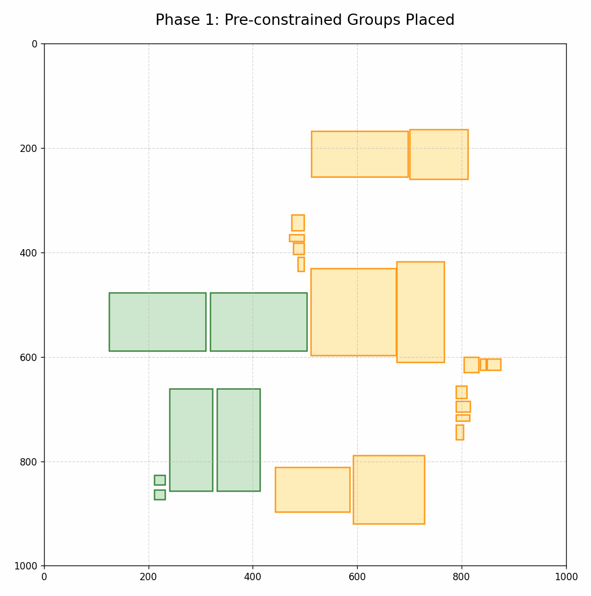

# Chip Synthetic Data Generation

## 專案總覽

本專案是一個用於**生成複雜二維積體電路佈局樣本**的工具鏈。其核心目標是透過一個受物理特性約束的、具備隨機性的演算法，自動產生大量多樣化的佈局資料集。
**此版本新增了生成預定義的類比對稱 (Symmetry)、對齊 (Alignment) 與階層式群組 (Hierarchical Grouping) 結構的功能，並能在機器學習格式化階段將對稱結構抽象化為單一節點，讓模型能以更宏觀的視角學習佈局**。

整個流程包含四個主要階段：
1.  **參數化組態**：透過 `config.yaml` 靈活定義生成規則，**包含對稱、對齊與群組的生成規則**。
2.  **佈局生成**：執行 `main.py`，根據組態產生包含**固定約束群組 (對稱/對齊)**、獨立元件、引腳和連線的原始佈局資料，並可選擇性地進行**階層式分群**。
3.  **分析與視覺化**：使用 `analyze_layout.py` 對單一樣本進行視覺化繪圖與數據統計分析。
4.  **機器學習格式化**：執行 `format_for_ml.py` 將整批原始資料轉換為模型訓練所需的圖結構資料，**此步驟會進行對稱群組的節點抽象化**。

---

## 檔案結構與功能說明

### 1. `config.yaml` - 參數設定檔

這是整個生成流程的控制中心，定義了所有固定與隨機參數。

-   **`run_settings`**: 設定執行參數，例如要產生的樣本總數 (`num_samples_to_generate`)。
-   **`path_settings`**: 設定原始資料與 ML 格式化資料的輸出路徑。
-   **`component_types`**: 定義不同元件類型（如 `macro`, `std_cell`）的尺寸、生長機率等屬性。
-   **`analog_symmetry_settings`**: 用於定義對稱類比電路群組的生成規則。
-   **`alignment_settings`**: 定義對齊群組的生成規則（如靠左對齊、置中對齊等）。
-   **`grouping_settings`**: 定義後處理階段的階層式分群規則，主要基於鄰近性。
-   **`base_params`**: 定義固定不變的基礎參數。這些是演算法的核心常數，例如畫布尺寸、最大迭代次數、生長步長、停滯與抖動的觸發條件等。
-   **`randomize_params`**: **此專案的關鍵特色**。定義了在每一輪樣本生成時需要隨機化的參數。這確保了生成的每個樣本都具有獨特的特性。**注意：`NUM_RECTANGLES` 代表在預置的對稱/對齊元件之外，額外隨機生成的元件數量**。

### 2. `main.py` - 主執行腳本

這是啟動資料集生成的進入點。

-   **讀取設定**: 首先會載入 `config.yaml` 的設定。
-   **生成迴圈**: 根據 `num_samples_to_generate` 的值，多次執行生成流程。
-   **參數隨機化**: 在每次迴圈中，呼叫 `get_randomized_params` 函數產生一組本次專用的參數。
-   **執行生成 (依序進行)**:
    1.  **階段一：對稱群組生成 (Symmetry)**：如果啟用，首先呼叫 `SymmetricGenerator` 放置帶有對稱引腳的固定元件群組。
    2.  **階段二：對齊群組生成 (Alignment)**：如果啟用，接著呼叫 `AlignmentGenerator` 放置固定的對齊元件群組。
    3.  **階段三：隨機元件填充**：在剩餘空間中，根據 `component_types` 的定義，放置指定數量的基礎元件（Macros 和 Standard Cells）。
    4.  **階段四：優化與生長**：實例化 `LayoutGenerator` 對所有「非固定」元件進行迭代生長與優化。
    5.  **階段五：階層式分群 (Grouping)**：如果啟用，呼叫 `LayoutGrouper` 對已放置好的元件（包含獨立元件與整個對稱/對齊群組）進行基於鄰近性的分群。
    6.  **階段六：引腳與連線生成**：為所有「非對稱群組」的元件生成引腳，然後在所有引腳之間建立連線。
-   **儲存結果**: 將生成的 `Layout` 物件（包含 `constraints` 等新屬性）及該次使用的參數序列化為 JSON 格式。

### 3. `symmetry.py` - 對稱群組生成器

一個專門用來生成具有嚴格對稱性的類比電路群組的模組。

-   **`SymmetricGenerator` 類**:
    -   `generate_analog_groups()`: 根據 `config.yaml` 的設定，生成多個對稱群組。
    -   **群組標記**: 為屬於同一個對稱結構的所有元件分配一個共同的 `symmetry_id`。這個 ID 是後續 ML 格式化進行節點抽象化的關鍵。
    -   **引腳對稱**: 在生成對稱元件時，其引腳的位置也嚴格遵循對稱規則。**此模組是唯一直接生成引腳的生成器**。
    -   **固定屬性**: 生成的元件會被標記為 `fixed = True`，在後續的生長優化中會被忽略。

### 4. `alignment.py` - 對齊群組生成器

一個用來生成沿著特定軸線對齊的元件群組的模組。

-   **`AlignmentGenerator` 類**:
    -   `generate_aligned_sets()`: 根據 `config.yaml` 的設定（如靠左、置中），生成多個對齊群組。
    -   **群組標記**: 為屬於同一個對齊群組的所有元件分配一個共同的 `alignment_id` 和 `alignment_type`。
    -   **固定屬性**: 生成的元件同樣被標記為 `fixed = True`。
    -   **注意**: 此模組不生成引腳。引腳會在 `main.py` 的最後階段統一生成。

### 5. `grouper.py` - 階層式分群模組

一個在佈局基本完成後，用來建立更高層次群組的後處理模組。

-   **`LayoutGrouper` 類**:
    -   `create_hierarchical_groups()`: 採用基於鄰近性的策略 (`proximity`) 進行分群。
    -   **處理對象**: 它將單一元件，以及整個對稱/對齊群組，都視為可被分群的「物件」。
    -   **群組標記**: 為被分到同一群組的元件添加 `grouping_id`。
    -   **執行時機**: 此模組在 `LayoutGenerator` 的生長優化完成**之後**執行。

### 6. `generator.py` - 核心佈局生成器

此檔案封裝了佈局生成的核心演算法，是整個專案技術含量最高的部分。

-   **`LayoutGenerator` 類**:
    -   `generate()`: 演算法主體。採用「智慧成長」策略對非固定元件進行迭代增長。
    -   **停滯處理機制**: 包含回退 (`_rollback_growth`)、抖動 (`_shake_components`)、填充 (`_infill_empty_spaces`) 等複雜策略，以應對增長停滯。
    -   **適應固定元件**: 其核心演算法會識別並**跳過** `rect.fixed == True` 的元件（即來自 `SymmetricGenerator` 和 `AlignmentGenerator` 的元件），確保這些預置結構的完整性。
-   **`QuadTree` 類**:
    -   一個四分樹資料結構，在 `_shake_components` 階段被用來快速查詢鄰近元件，大幅提升碰撞檢測的效率。

### 7. `layout.py` - 核心資料結構

此檔案定義了構成一個「佈局」的基礎物件。

-   **`Rectangle` 類**: 代表一個元件。
    -   **新增 `constraints` 字典**: 用於儲存 `symmetry_id`, `alignment_id`, `grouping_id` 等約束資訊。
    -   **新增 `fixed` 屬性**: 標記其是否為在生長階段不可變的元件。
-   **`Layout` 類**: 代表一個完整的佈局。
    -   `generate_pins()`: **此函式現在只為非對稱群組的元件生成引腳**。
    -   `generate_edges()`: 在不同元件的引腳之間建立連線。

### 8. `analyze_layout.py` - 視覺化與分析工具

一個後處理腳本，用於深入理解單個生成的樣本。

-   **視覺化**: 使用 `matplotlib` 將 JSON 檔案中的佈局繪製出來。**不同約束類型（對稱、對齊、群組）的元件會以不同顏色顯示**，方便辨識。
-   **統計分析**: 計算並印出一份分析報告，包含元件總數、引腳總數、連線總數及線長分佈等。

### 9. `visualize_abstraction.py` - 抽象化視覺化工具

一個用於清晰地展示**概念上**抽象化過程的後處理腳本。

-   **功能**: 該工具會生成一張對比圖，包含兩個子圖：
    1.  **左圖 (Original Detailed Layout)**: 顯示真實的物理佈局，不同約束的元件會以不同顏色標示。
    2.  **右圖 (Abstracted View)**: 顯示一個**概念上**的抽象視圖。所有約束群組（對稱、對齊、階層）都會被一個**虛線邊界框**取代。
-   **用途**: 幫助使用者理解不同約束的意圖。**請注意**，此圖僅為概念展示，在實際的 ML 格式化中，只有對稱群組會被合併為單一節點。

### 10. `format_for_ml.py` - 機器學習格式化與群組抽象化工具

將原始 JSON 資料集轉換為適用於圖機器學習模型的格式。

-   **群組抽象化 (Node Merging)**:
    -   此腳本會遍歷所有元件，將擁有相同 `symmetry_id` 的元件**合併**成一個**單一的抽象節點**。
    -   對於獨立元件、對齊元件、或階層式群組中的元件，則依然被視為獨立的節點。
-   **約束邊生成 (Edge Creation)**:
    -   `alignment` 和 `grouping` 約束**不會**被合併成節點，而是轉換為圖中的**特殊邊類型**（`align_edge`, `group_edge`），用來連接相關的節點，將約束關係傳遞給模型。
-   **格式轉換**: 將每個 layout JSON 轉換為包含節點特徵 (`node`)、目標位置 (`target`)、邊索引與特徵 (`edges`)、以及用於還原詳細佈局的 `sub_components` 資訊的字典。

### 11. `merge_datasets.py` & `demo_generator.py`

-   `merge_datasets.py`: 用於合併多個已生成資料集的工具。
-   `demo_generator.py`: 用於生成 GIF 動態展示圖的腳本，會依次展示對稱放置、隨機填充和生長優化的過程。

---

## 如何使用

1.  **組態參數**:
    -   打開 `config.yaml` 檔案。
    -   在 `analog_symmetry_settings`, `alignment_settings`, `grouping_settings` 中組態您想要的生成規則，或將對應的 `enable` 設為 `false` 來停用。
    -   在 `run_settings` 中設定您想生成的樣本數量。
    -   根據需求調整 `randomize_params`。

2.  **生成原始資料集**:
    -   在終端機中執行 `python main.py`。
    -   程式會開始生成樣本，並將結果儲存在 `config.yaml` 中指定的 `raw_output_directory`。

3.  **分析單一樣本 (可選)**:
    -   執行 `python analyze_layout.py <path_to_your_json_file>`。
    -   程式會顯示該佈局的視覺化圖表和統計報告。

4.  **格式化整個資料集以供模型訓練**:
    -   執行 `python format_for_ml.py`。
    -   此腳本會自動從 `config.yaml` 讀取輸入和輸出路徑。
    -   程式會讀取所有原始 JSON 檔案，將它們轉換為 ML-ready 格式（包含對稱群組抽象化與約束邊生成），並儲存到 `ml_ready_output_directory`。

5.  **視覺化檢查抽象結果**:
    -   執行 `python visualize_abstraction.py <path_to_original_json> <output_image_name.png>`。
    -   打開生成的圖片，對比左邊的詳細佈局與右邊的概念性抽象視圖。

## Demo

## Reference

Lee, V., Deng, C., Elzeiny, L., Abbeel, P., & Wawrzynek, J. (2024).
[Chip Placement with Diffusion](https://arxiv.org/abs/2407.12282v1). *arXiv:2407.12282v1 [cs.LG]*.